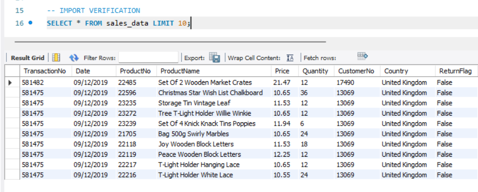
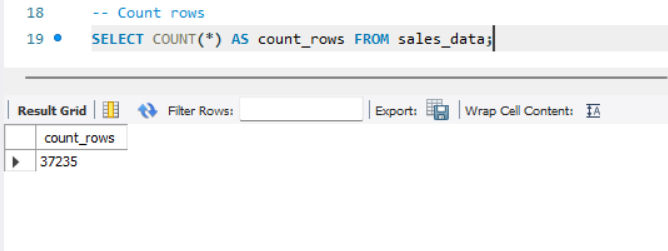
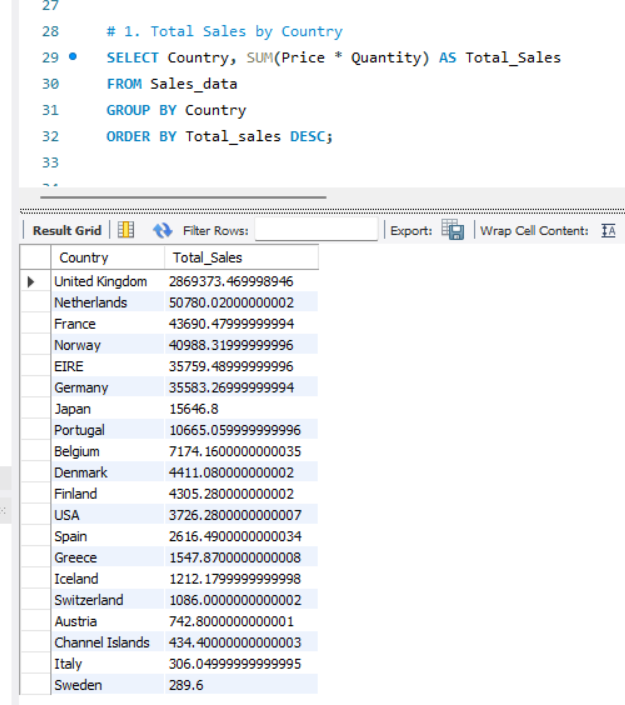
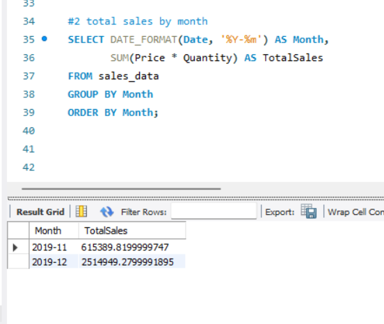
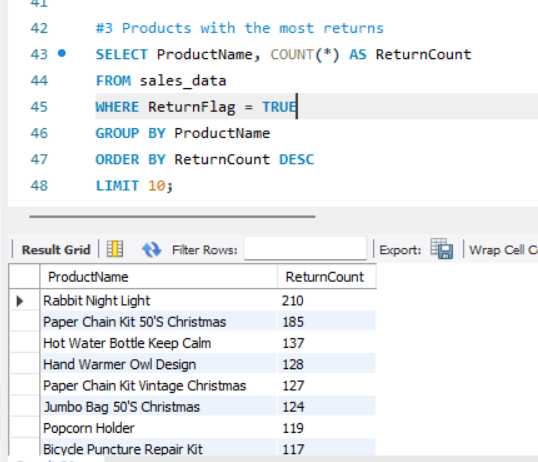
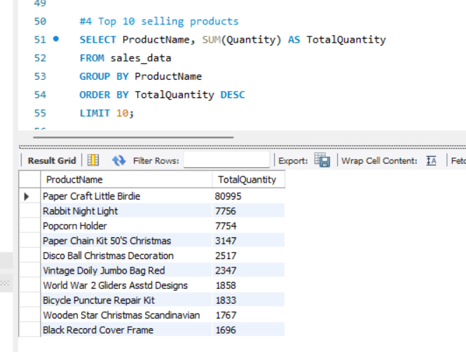
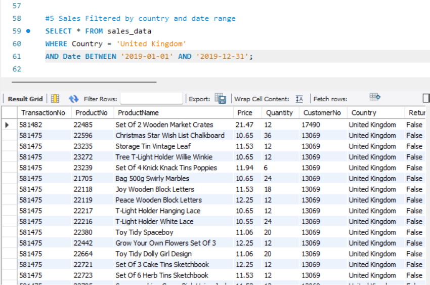

# 🛒 E-Commerce Sales Data Analysis (MySQL Project)

## 📌 Project Overview
This project focuses on analyzing e-commerce sales data using **MySQL**.  
It involves creating a database, importing data, performing data cleaning, indexing, and running analytical queries to uncover sales trends, top products, customer insights, and return patterns.

---

## 📂 Dataset
- **File:** `cleaned_sales_data.csv` (zipped as `cleaned_sales_data.zip`)
- **Rows:** ~5000+
- **Columns:** TransactionNo, Date, ProductNo, ProductName, Price, Quantity, CustomerNo, Country, ReturnFlag

---

## 🛠️ Process
1. **Created Database & Table Structure** in MySQL.
2. **Imported Dataset** from CSV after cleaning.
3. Fixed **date formats** and ensured correct data types.
4. Created **indexes** for performance optimization.
5. Ran SQL queries for:
   - Total revenue calculation
   - Top-selling products
   - Monthly sales analysis
   - Sales by country
   - Return analysis

---

## 📊 Key Insights
- **Seasonal Trends:** Most sales occur during Nov–Dec (holiday season).
- **Top Products:** Few products contribute the majority of revenue.
- **Country Trends:** UK customers dominate the sales.
- **Returns:** Less than 5% of orders are returned.

---

## 🖼️ Screenshots

---

## 📈 Tools Used
- MySQL Workbench
- CSV Data
- SQL Queries & Indexing

---

## 📄 Files in Repository
- `cleaned_sales_data.zip` → Dataset
- `Task 4.pdf` → Project Report
- `SS_1.png` to `SS_7.png` → Step-by-step screenshots
- `README.md` → Project Documentation

---

## 🚀 Author
*Rutikesh Pawar*
